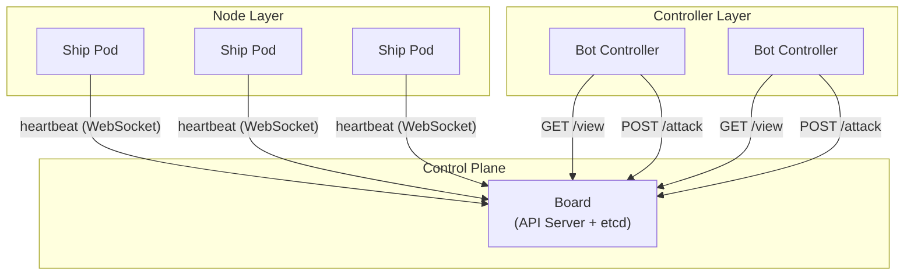
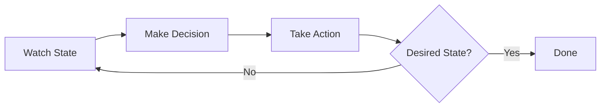
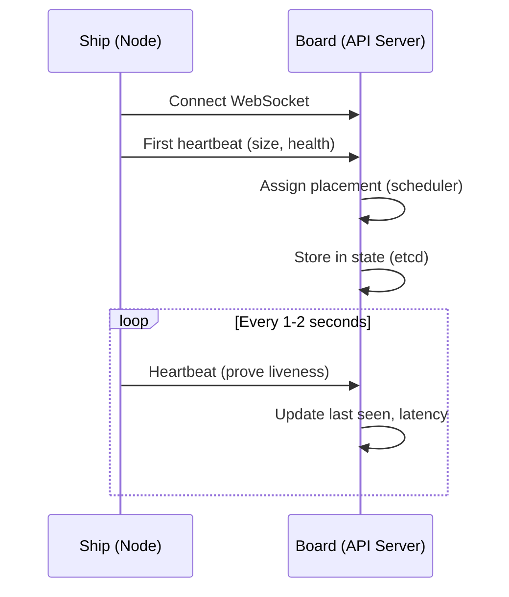
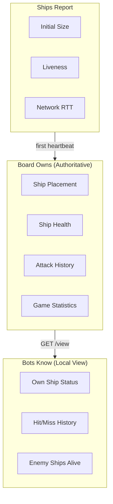

# ClusterShip

Distributed battleship game designed for Kubernetes. Ships run as independent containers connecting via WebSocket, bots attack via HTTP API, and the board acts as the control plane.

## Architecture

```
┌─────────────────────────────────────────┐
│      Board (Control Plane)              │
│  - Owns game state                      │
│  - WebSocket: /ws/battleship            │
│  - HTTP: /attack, /view, /stats         │
└─────────────────────────────────────────┘
         ↑ WebSocket              ↑ HTTP
┌────────────────────┐    ┌────────────────────┐
│   Ship Containers  │    │   Bot Containers   │
│   (send heartbeats)│    │   (call /attack)   │
└────────────────────┘    └────────────────────┘
```

## Quick Start

### All-in-one mode
```powershell
go run ./cmd/clustership-game --width=10 --height=10
```

### Distributed mode
```powershell
# Terminal 1: Start board (control plane)
go run ./cmd/clustership-board --width=10 --height=10

# Terminal 2-4: Start ships
go run ./cmd/clustership-ship -id=red-1 -size=4
go run ./cmd/clustership-ship -id=red-2 -size=3
go run ./cmd/clustership-ship -id=blue-1 -size=4

# Terminal 5-6: Start bots
go run ./cmd/clustership-bot -id=red-bot
go run ./cmd/clustership-bot -id=blue-bot
```

## Binaries

| Binary | Purpose |
|--------|---------|
| `clustership-game` | All-in-one game (board + ships + bots) |
| `clustership-board` | Standalone control plane |
| `clustership-ship` | Standalone ship node |
| `clustership-bot` | Standalone bot attacker |

## HTTP API

| Endpoint | Method | Description |
|----------|--------|-------------|
| `/ws/battleship?node_id=X` | WebSocket | Ship heartbeat connection |
| `/attack?bot_id=X` | POST | Attack at `{x, y}` |
| `/view?bot_id=X` | GET | Bot's view of board |
| `/stats` | GET | Board statistics |
| `/healthz` | GET | Health check |

## Kubernetes Mapping

ClusterShip mirrors real Kubernetes architecture. Each component has a direct parallel:

| ClusterShip | Kubernetes | Role |
|-------------|------------|------|
| Board | API Server + etcd | Single source of truth, owns all state |
| Ships | Nodes / Kubelets | Register with control plane, send heartbeats |
| Bots | Controllers | Watch state, make decisions, take actions |
| `/view` | Watch/List API | Read current state |
| `/attack` | Create/Update API | Mutate state |
| `/stats` | Metrics API | Observability |
| `game_id` | Namespace | Multi-tenant isolation |

### System Architecture



### Controller Reconciliation Loop

Bots implement the standard Kubernetes controller pattern: watch state, decide, act, repeat.



In ClusterShip terms:
- **Watch**: `GET /view` returns what the bot knows (own ships, attack history, enemy count)
- **Decide**: Pick next target using targeting algorithm
- **Act**: `POST /attack` fires at chosen coordinate
- **Desired State**: All enemy ships destroyed (`enemy_alive = 0`)

### Node Registration Flow

Ships register with the board just like Kubelets register with the API server.



### State Ownership

The board is the **single source of truth**, just like etcd in Kubernetes:



### Performance Testing

This architecture enables Kubernetes-style performance testing:

| Test | What It Measures | K8s Equivalent |
|------|------------------|----------------|
| Ship scaling | Max nodes before control plane degrades | Node scalability |
| Attack throughput | Mutations per second | API server throughput |
| Heartbeat latency | Network RTT to control plane | kubelet-apiserver latency |
| Multi-game isolation | Concurrent namespaces | Namespace scalability |

The `/stats` endpoint exposes metrics: total attacks, hits, misses, heartbeats, connections, and average latency.

## Build
```powershell
go build -o bin/ ./cmd/...
```

## Test
```powershell
go test ./...
```


