# ClusterShip

A terminal-based battleship game that teaches Kubernetes concepts through gameplay. Battle AI companies (Netflix, AWS, Google) on a shared ocean while learning about pods, services, affinity, and rescheduling. Optionally deploy real K8s workloads to your cluster.

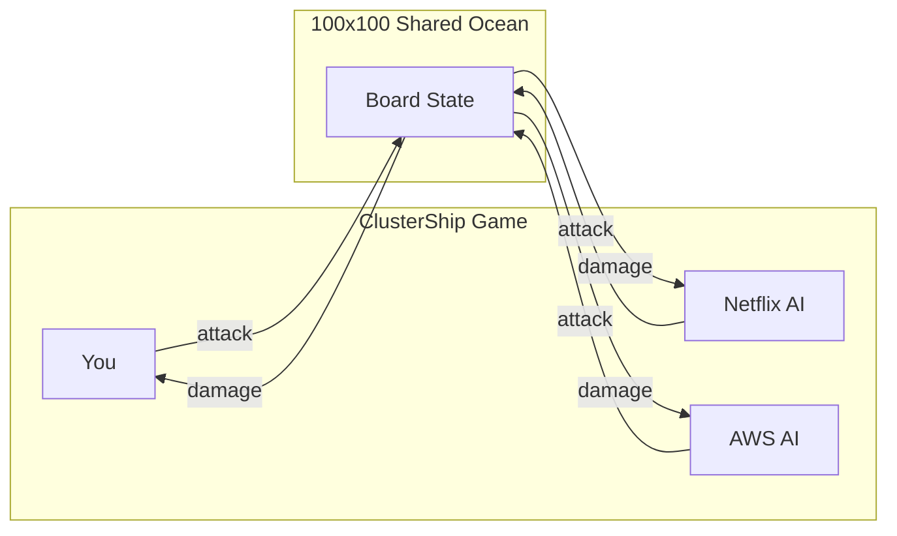

## Quick Start

```bash
# Run the game
go run ./cmd/clustership

# Or build and run
go build -o clustership ./cmd/clustership
./clustership
```

## Game Overview

```
┌─────────────────────────────────────────────────────────────────────────────┐
│  CLUSTERSHIP - Player vs Netflix vs AWS           Turn: 42  [VIEW 1/5]     │
├─────────────────────────────────────────────────────────────────────────────┤
│                                                                             │
│  100x100 SHARED OCEAN                    SERVICE STATUS                     │
│  ┌─────────────────────────────┐         [!]Origin API  [████░] 80%        │
│  │ . . . . X . . . . .        │         [~]CDN Edge    [█████] 100%        │
│  │ . . # # # # # . . .        │         [o]Playback    [███░░] 60%         │
│  │ . . . . . . . . . .        │         [-]Encoding    [██░░░] 40%         │
│  │ . . . . . O . . . .  <cursor                                            │
│  │ . . . . . . . . . .        │         K8S EVENTS                         │
│  └─────────────────────────────┘         [+] Pod cdn-edge rescheduled      │
│                                          [!] Pod database pending          │
│  [1-5] view  [arrows] move  [enter] fire  [q] quit                         │
└─────────────────────────────────────────────────────────────────────────────┘
```

### Features

- **Multi-company battles**: Player vs 1-5 AI opponents (Netflix, AWS, Google, etc.)
- **Shared ocean**: All fleets on one 100x100 board, no overlap
- **5 view levels**: Map, Ship, Rack, YAML, Rack Layout
- **Pod affinity simulation**: Hard, Soft, Spread, None - affects rescheduling
- **Real K8s integration**: Deploy actual pods to your cluster
- **Demo mode**: Watch AI vs AI battles
- **Configurable**: Board size, ships, racks, pods, turn delay

## Controls

| Key | Action |
|-----|--------|
| Arrow keys / WASD | Move cursor |
| Enter / Space | Fire at cursor position |
| 1-5 | Change view level |
| C | Cycle service display (your services vs enemy) |
| D | Toggle debug mode (see all ships) |
| Q | Quit / Back to menu |

## View Levels

| Key | View | Description |
|-----|------|-------------|
| 1 | Map | Overview of the ocean with ships and attacks |
| 2 | Ship | List of your regions (ships) with health status |
| 3 | Rack | Drill into racks within a ship |
| 4 | YAML | K8s manifests (fog of war for enemies) |
| 5 | Rack Layout | Visual grid showing pod distribution per rack |

---

## Game Flow

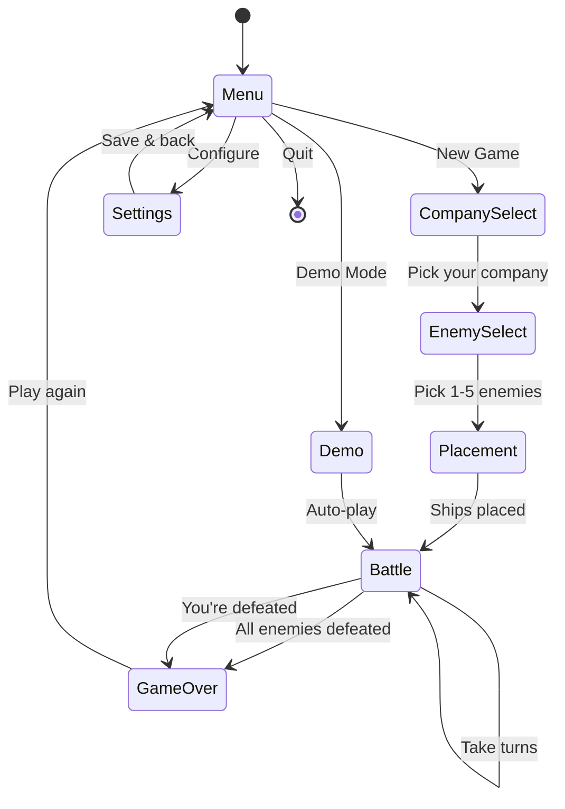

---

## Kubernetes Architecture Mapping

ClusterShip mirrors real Kubernetes architecture. Every game component has a direct K8s equivalent.

### System Architecture

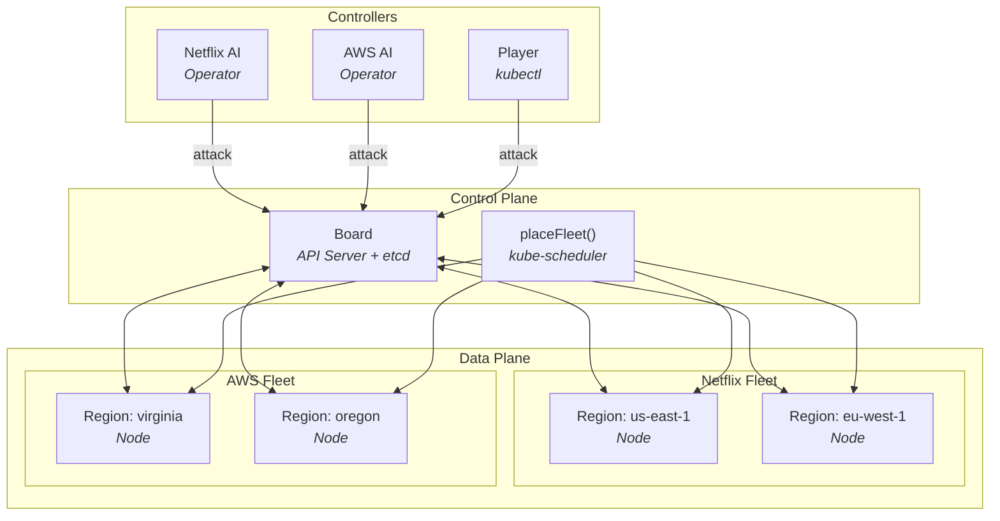

### Component Mapping

| ClusterShip | Kubernetes | Role |
|-------------|------------|------|
| **Board** | API Server + etcd | Single source of truth, owns all game state |
| **Company** | Namespace | Isolated group of resources |
| **Region (Ship)** | Node | Physical machine / data center |
| **Rack (Cell)** | Node capacity | Individual server slot |
| **Pod** | Pod | Workload unit that can be killed/rescheduled |
| **Service** | Service + Deployment | Logical grouping with desired replica count |
| **AI Player** | Controller/Operator | Watches state, makes decisions, takes actions |
| **Attack** | kubectl delete pod | Destroys workloads |
| **Rescheduling** | Pod eviction/recreation | Moves pods based on affinity rules |

### Hierarchy Diagram

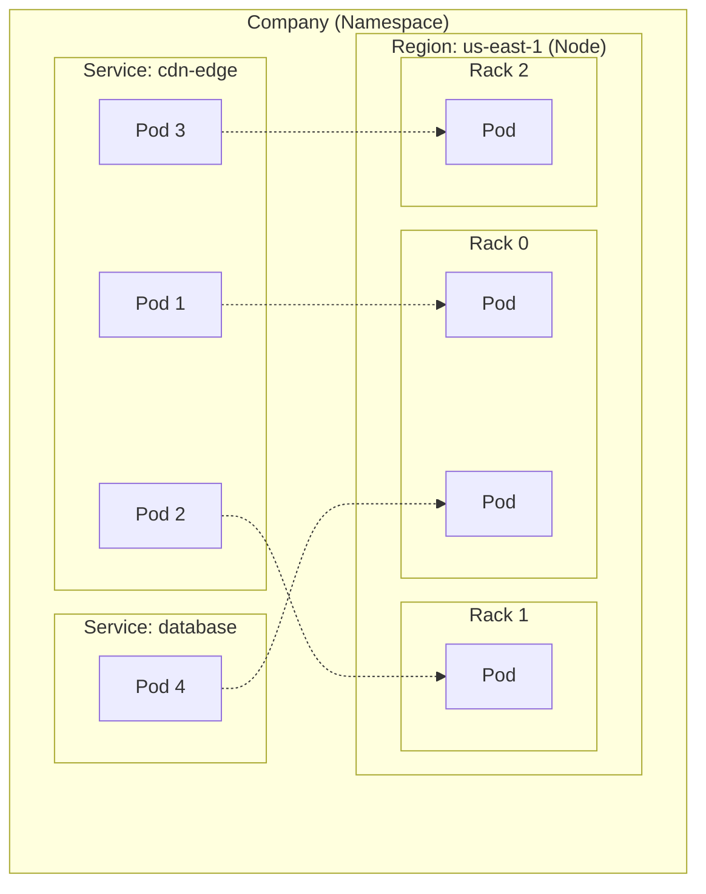

### Affinity Types

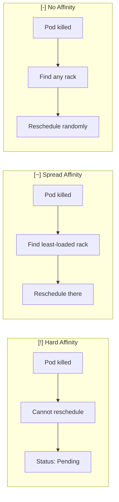

| Affinity | Icon | Rescheduling | K8s Equivalent | Example |
|----------|------|--------------|----------------|---------|
| **Hard** | [!] | NO | requiredDuringScheduling | Primary database - can't move |
| **Soft** | [o] | Yes, prefers same region | preferredDuringScheduling | API servers |
| **Spread** | [~] | Yes, spreads across racks | podAntiAffinity | CDN edge nodes |
| **None** | [-] | Yes, anywhere | No constraints | Encoding workers |

---

## Attack Flow

When you fire at a cell, here's what happens:

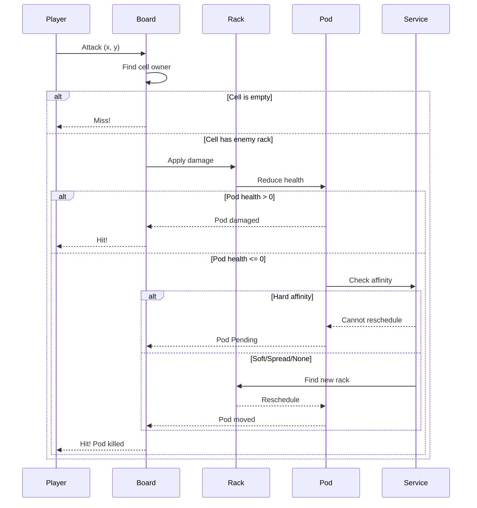

### Pod Lifecycle

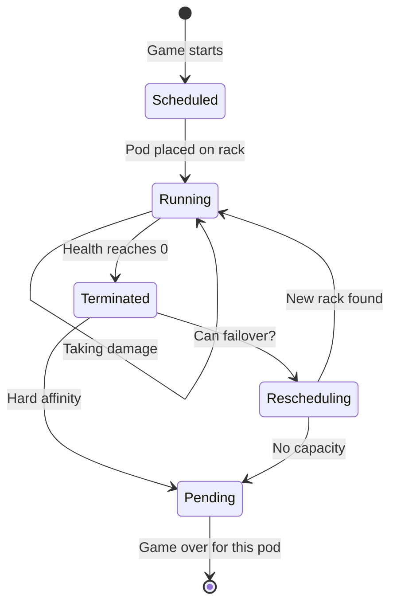

---

## AI Controller Pattern

AI players implement the Kubernetes controller reconciliation loop:

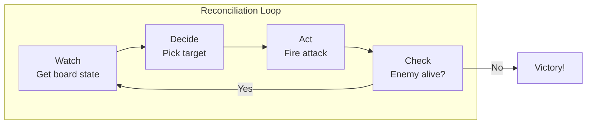

### AI Strategies

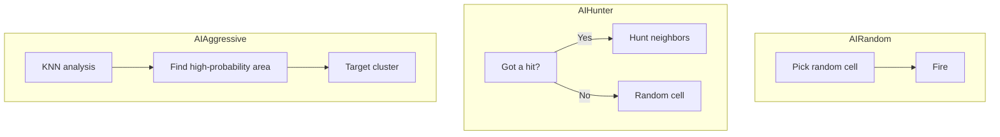

---

## Real Kubernetes Integration

When `EnableRealK8s=true`, the game deploys actual K8s workloads:

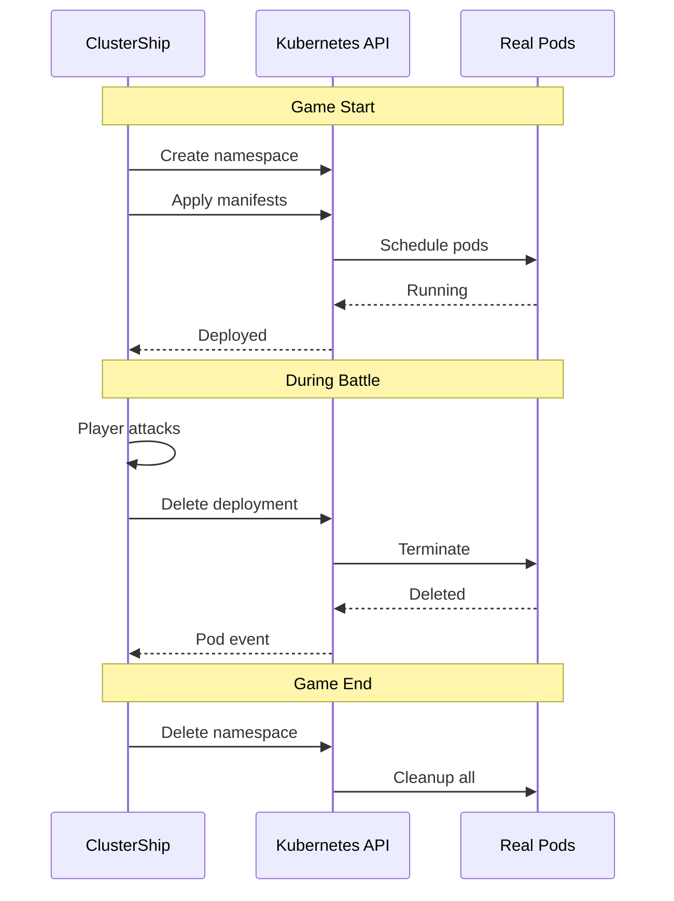

### What Happens

| Game Event | K8s Action |
|------------|------------|
| Start game | `kubectl apply` all company manifests to `clustership` namespace |
| Attack kills pod | `kubectl delete` matching deployment/pods |
| Poll events | Watch API streams pod Added/Modified/Deleted events |
| End game | `kubectl delete namespace clustership` |

### Real Workloads

The templates in `templates/k8s/` are **real K8s manifests** that run actual containers:

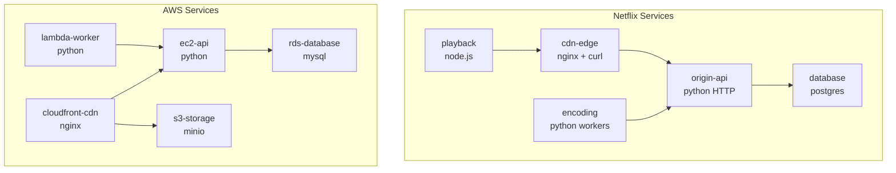

Each service uses **250-500m CPU** and **256-512Mi memory** with inter-service traffic via curl sidecars.

### Setup

```bash
# Create a local cluster
kind create cluster

# Or enable Docker Desktop Kubernetes

# Enable in game settings
# Settings -> Kubernetes -> Toggle Real K8s: ON

# Start game - watch pods deploy
kubectl get pods -n clustership -w
```

### Example Session

```bash
# Start game with Netflix as enemy
# Game deploys:
kubectl get deployments -n clustership
# NAME                    READY   UP-TO-DATE   AVAILABLE
# netflix-cdn-edge        3/3     3            3
# netflix-playback        2/2     2            2
# netflix-origin-api      2/2     2            2
# netflix-database        1/1     1            1
# netflix-encoding        3/3     3            3

# Attack kills a pod
# Game runs: kubectl delete deployment netflix-cdn-edge

# End game cleans up
kubectl get ns clustership
# namespace "clustership" deleted
```

---

## Configuration

Settings are stored in `~/.clustership/config.json`:

```json
{
  "boardWidth": 100,
  "boardHeight": 100,
  "shipsPerPlayer": 5,
  "racksPerShip": 3,
  "podsPerRack": 3,
  "turnDelayMs": 200,
  "enableRealK8s": false,
  "k8sNamespace": "clustership",
  "kubeconfig": "~/.kube/config"
}
```

Access via in-game Settings menu.

---

## Project Structure

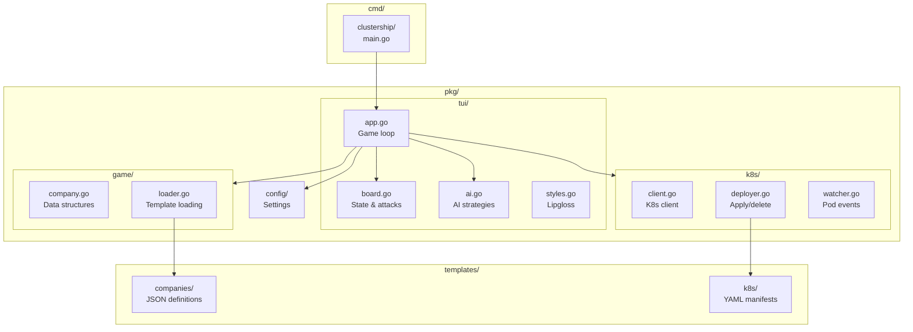

```
clustership/
├── cmd/clustership/          # Main entry point
├── pkg/
│   ├── tui/                  # Terminal UI (Bubble Tea)
│   │   ├── app.go            # Main game loop, state machine
│   │   ├── board.go          # Board state, attacks, scheduling
│   │   ├── ai.go             # AI targeting strategies
│   │   └── styles.go         # Lipgloss styling
│   ├── game/                 # Game data structures
│   │   ├── company.go        # Company, Region, Rack, Pod, Service
│   │   ├── loader.go         # Load company templates
│   │   └── events.go         # K8s-style events
│   ├── k8s/                  # Real K8s integration
│   │   ├── client.go         # K8s client wrapper
│   │   ├── deployer.go       # Deploy/delete manifests
│   │   ├── loader.go         # Parse YAML manifests
│   │   ├── watcher.go        # Watch pod events
│   │   └── types.go          # K8s types
│   └── config/               # Configuration
│       └── config.go         # Load/save settings
├── templates/
│   ├── companies/            # Company definitions (JSON)
│   │   ├── netflix.json
│   │   ├── aws.json
│   │   └── ...
│   └── k8s/                  # Real K8s manifests (YAML)
│       ├── netflix/
│       │   ├── cdn-edge.yaml
│       │   ├── database.yaml
│       │   └── ...
│       └── aws/
│           ├── ec2-api.yaml
│           └── ...
└── README.md
```

---

## Build & Run

```bash
# Build
go build -o clustership ./cmd/clustership

# Run
./clustership

# Run with Go directly
go run ./cmd/clustership

# Build all
go build ./...

# Test
go test ./...
```

## Dependencies

- [Bubble Tea](https://github.com/charmbracelet/bubbletea) - Terminal UI framework
- [Lip Gloss](https://github.com/charmbracelet/lipgloss) - Styling
- [client-go](https://github.com/kubernetes/client-go) - K8s client (optional)

---

## Learning Kubernetes

ClusterShip teaches these K8s concepts through gameplay:

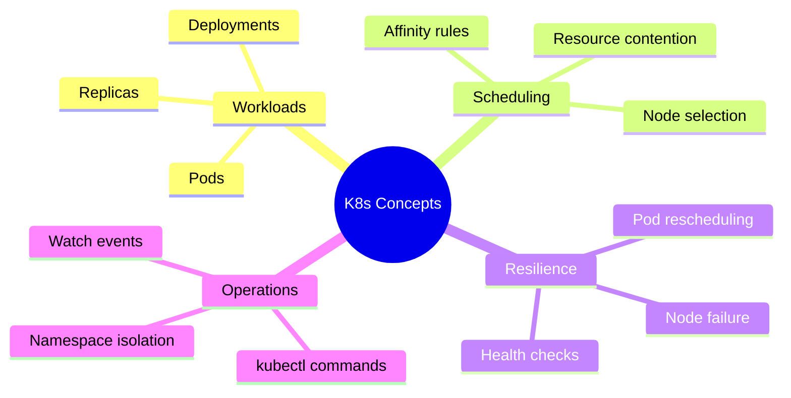

| Concept | How You Learn It |
|---------|------------------|
| **Pods** | Each unit on a rack is a pod that can be killed |
| **Deployments** | Services maintain desired replica count |
| **Scheduling** | Ships are placed avoiding overlap (resource contention) |
| **Affinity** | Hard affinity pods can't reschedule when hit |
| **Anti-affinity** | Spread affinity distributes pods across racks |
| **Node failure** | Destroying a rack triggers pod rescheduling |
| **Service health** | Health bars show running vs total pods |
| **Events** | K8s-style event log shows pod lifecycle |
| **Namespaces** | Each company is isolated like a namespace |
| **kubectl** | Real K8s mode uses actual kubectl operations |

---

## License

MIT
